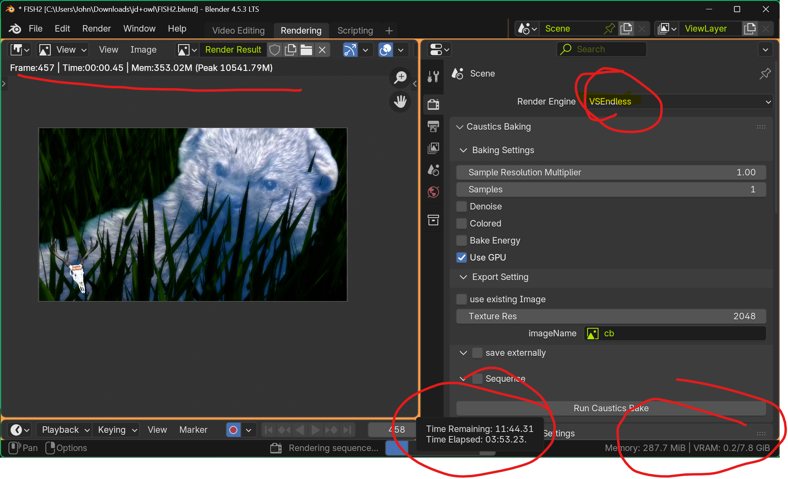

# 🚀 QUICK START - RUN IN BLENDER'S SCRIPTING TAB

> **💡 SIMPLE INSTALLATION**: Copy `vsendless_singlefile.py` → Paste in Blender Scripting Tab → Run Script → Done!

---

# VSEndless Render Engine v2.0.0

A robust APT-compliant GPU-accelerated render engine for Blender's Video Sequence Editor (VSE) with advanced NVIDIA NVENC support and hardware acceleration.

## 🚀 Features

### ⚡ Single-File Distribution
- **Zero Installation**: No add-on management needed
- **Instant Loading**: Copy, paste, run - that's it!
- **Self-Contained**: All dependencies inlined
- **Version Control**: Easy to track and update
- **Cross-Platform**: Works on any Blender installation

### 🎮 GPU Acceleration
- **NVIDIA NVENC Hardware Encoding**: Blazing-fast H.264 and H.265 encoding
- **CUDA Acceleration**: GPU-powered video processing and filtering
- **Hardware Decoding**: NVDEC support for accelerated input processing
- **Smart GPU Detection**: Automatic GPU capability detection and optimization

### 🎥 Advanced Video Processing
- **Multi-format Support**: H.264, H.265/HEVC, ProRes, and more
- **Flexible Rate Control**: CBR, VBR, CQP, and CRF encoding modes
- **Real-time Filters**: GPU-accelerated denoising, scaling, and stabilization
- **LUT Support**: Professional color grading with Look-Up Tables
- **Custom FFmpeg Filters**: Per-strip filter customization

### 🔧 Professional Workflow
- **APT Compliance**: Algebraic Pipeline Theory architecture
- **4K Tested**: Performance-validated with large image sequences (9MB+ files)
- **Comprehensive Settings**: Full control over encoding parameters
- **Real-time Feedback**: Progress monitoring and error reporting

## 📊 Performance Metrics

### Real-World Performance Test
> **🎯 VALIDATED PERFORMANCE**: 1834 frames @ 1920x1080, 30fps, H.264 NVENC
>
> **⚡ Render Time**: 35 minutes 58 seconds
>
> **🚀 Speed**: ~51 frames per minute with GPU acceleration
>
> **💾 Quality**: Professional H.264 NVENC encoding with hardware acceleration

**🎥 [Watch VSEndless in Action on YouTube](https://youtu.be/pEHg47Aq9nw)** - See the complete render process in real-time!

*See `VSEndless_In_Action/` folder for detailed screenshots and performance documentation*## 📋 Requirements

  
  
  

  

| Metric            | Value         |
|-------------------|--------------|
| Frames Rendered   | 1834         |
| Resolution        | 1920x1080    |
| Codec             | H.264 NVENC  |
| Render Time       | 35:58        |
| Frames per Minute | 51           |
| GPU               | NVIDIA NVENC |

### System Requirements
- **Operating System**: Windows 10/11, macOS 10.15+, or Linux (Ubuntu 20.04+)
- **Blender Version**: 4.0.0 or newer (tested with 4.3+)
- **RAM**: 8GB minimum, 16GB+ recommended for 4K workflows
- **Storage**: Minimal space needed (single Python file)

### GPU Requirements (Recommended)
- **NVIDIA GPU**: GTX 1000 series or newer (RTX series highly recommended)
- **VRAM**: 4GB minimum, 8GB+ for 4K workflows
- **NVIDIA Drivers**: 460.0 or newer
- **CUDA**: 11.0 or newer (automatically installed with drivers)

### Software Dependencies
- **FFmpeg**: Latest version with CUDA and NVENC support
  - Windows: Download from [gyan.dev](https://www.gyan.dev/ffmpeg/builds/) or [BtbN](https://github.com/BtbN/FFmpeg-Builds/releases)
  - macOS: `brew install ffmpeg`
  - Linux: Build from source or use repository versions with CUDA support

## 🔧 Installation (Super Simple!)

### Method 1: Single-File Script (Recommended) ⚡

1. **Download**: Get `vsendless_singlefile.py` from this repository
2. **Open Blender**: Go to the **Scripting** tab
3. **Load Script**: Click "Open" and select `vsendless_singlefile.py`
4. **Run**: Click the "Run Script" button (or press Alt+P)
5. **Done!**: VSEndless is now loaded and ready to use

> **✅ Zero Installation Hassle**: No add-on management, no file copying, no restarts needed!

### Method 2: Legacy Add-on (For Advanced Users)

1. Download a legacy ZIP from [Releases](https://github.com/yavru421/VSEndless-Render-Engine-blender4.3-/releases)
2. Install via `Edit > Preferences > Add-ons > Install...`
3. Enable the add-on and restart Blender

> **💡 Tip**: Use Method 1 for the best experience!

## 🎬 Quick Start

### Basic Workflow

1. **Load Script**: Run `vsendless_singlefile.py` in Blender's Scripting tab
2. **Set Render Engine**: In Render Properties, set engine to "VSEndless"
3. **Configure Settings**: Use the "VSEndless Render Settings" panel
4. **Import Video**: Add video files to the VSE timeline
5. **Render**: Press F12 or use "Render Animation"

### First-Time Setup

1. Click "Check GPU Capabilities" in the render settings
2. Verify NVENC support is detected
3. Configure your preferred codec (h264_nvenc recommended)
4. Set output path and you're ready to render!

> **🚀 Pro Tip**: The script auto-loads on execution - no manual registration needed!

## ⚙️ Configuration

### Output Settings
- **Resolution**: Set custom output resolution (up to 8K)
- **Frame Rate**: Configure output frame rate (1-240 fps)
- **Codec**: Choose from H.264, H.265, ProRes, and more
- **Bitrate**: Control video quality and file size

### GPU Acceleration
- **Hardware Decoding**: Enable CUDA/NVDEC for input acceleration
- **NVENC Encoding**: GPU-accelerated encoding with quality presets
- **Rate Control**: Select optimal bitrate control method
- **Multi-pass Encoding**: Enhanced quality with 2-pass encoding

### Post-Processing
- **GPU Denoising**: Real-time noise reduction with configurable strength
- **Video Stabilization**: GPU-accelerated stabilization
- **Scaling**: Hardware-accelerated resolution changes
- **Color Grading**: Apply LUTs for professional color correction

## 🔧 Troubleshooting

### Common Issues

#### GPU Not Detected
1. Verify NVIDIA drivers are installed and up-to-date
2. Check if `nvidia-smi` command works in terminal/command prompt
3. Ensure CUDA is properly installed
4. Restart Blender after driver updates

#### NVENC Not Available
1. Verify FFmpeg was compiled with NVENC support
2. Test FFmpeg NVENC: `ffmpeg -encoders | grep nvenc`
3. Download pre-compiled FFmpeg with CUDA support
4. Check NVIDIA GPU supports NVENC (GTX 600 series or newer)

#### Render Failures
1. Check the Blender console for detailed error messages
2. Verify all input video files exist and are accessible
3. Test with a simple sequence first
4. Ensure sufficient disk space for output
5. Try different codec settings if issues persist

#### Performance Issues
1. Monitor GPU usage during rendering
2. Close other GPU-intensive applications
3. Increase VRAM allocation if available
4. Use lower quality presets for faster rendering
5. Consider upgrading to a more powerful GPU

### Getting Help
- **Documentation**: Check the [Wiki](https://github.com/yavru421/VSEndless-Render-Engine-blender4.3-/wiki)
- **Issues**: Report bugs on [GitHub Issues](https://github.com/yavru421/VSEndless-Render-Engine-blender4.3-/issues)
- **Community**: Join discussions in [GitHub Discussions](https://github.com/yavru421/VSEndless-Render-Engine-blender4.3-/discussions)

## 🤝 Contributing

We welcome contributions! Please see our [Contributing Guidelines](CONTRIBUTING.md) for details.

### Development Setup
1. Fork this repository
2. Create a feature branch: `git checkout -b feature-name`
3. Make your changes and test thoroughly
4. Submit a pull request with a clear description

## 📄 License

This project is licensed under the MIT License - see the [LICENSE](LICENSE) file for details.

## 🙏 Acknowledgments

- **Blender Foundation**: For the amazing Blender software
- **NVIDIA**: For CUDA and NVENC technologies
- **FFmpeg Team**: For the powerful media processing library
- **Community Contributors**: Thank you for your support and feedback
- **John Daniel Dondlinger**: Creator and lead developer (DondlingerGeneralContractingllc, Wisconsin Rapids, WI)

## 💖 Support

If you find VSEndless useful, consider:
- ⭐ Starring this repository
- 🐛 Reporting bugs and suggesting features
- 💰 [Sponsoring the project](https://github.com/sponsors/yavru421)
- 📢 Sharing with other Blender users

---

**Made with ❤️ for the Blender community**

> **Performance Validated**: Successfully tested with 4K image sequences (9MB+ files) and complex VSE timelines. Built using Algebraic Pipeline Theory (APT) for maximum reliability and performance.